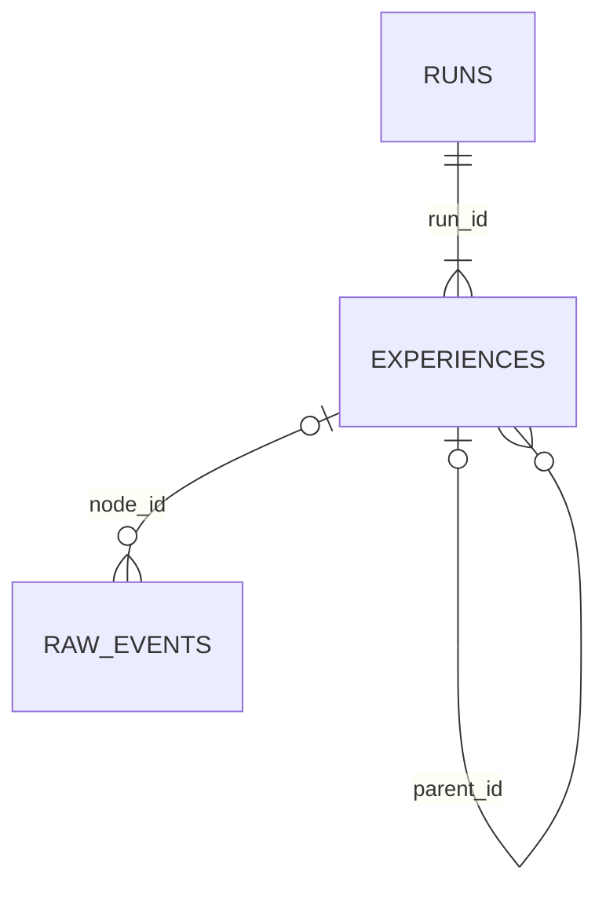

# Dream-RSI Experience Store

Codex/autoresearchの実行履歴を、Dream-RSIのreplayで使いやすい形にまとめたデータセットです。

最初に見るファイルは次の2つです。

- `experience_store/experience.xlsx`: 人が内容を確認するためのExcel
- `experience_store/experience.db`: Pythonやreplay engineから読むSQLite DB

## 探索木はどこで見られるか

### Excelで見る

`experience_store/experience.xlsx`の`Experiences`シートが探索木です。

1. `run_id`で見たいrunをfilterする
2. `sequence_index`の昇順で並べる
3. `node_id`と`parent_id`で親子関係を見る
4. `depth`と`display_path`でrootからの経路を見る

Excelでは1行が1 DiscoveryNodeです。専用のgraph画面ではなく、filter可能な表として表示します。

| Column | 意味 |
|---|---|
| `run_id` | どの探索木に属するか |
| `node_id` | node自身のID |
| `parent_id` | 親node。rootだけNULL |
| `branch_id` | A、B、baselineなどのbranch名 |
| `depth` | rootからの深さ。rootは0 |
| `display_path` | rootから現在nodeまでのnode ID列 |
| `proposal` | このnodeで試した内容 |
| `score` | 元実験に記録されたscore |
| `metrics_json` | nodeに属するmetric |

### ターミナルで木として見る

全runの探索木をASCII treeで表示できます。

```bash
cd /Users/cls-lab/Git/NEDO_RSI
python3 dream_rsi_experience_store/scripts/print_trees.py
```

1つのrunだけ見る場合:

```bash
python3 dream_rsi_experience_store/scripts/print_trees.py \
  --run-id run_660e45cf1cdc2d1538b777eb
```

主な比較runは次の形です。

```text
baseline score=1.000000
├── A_01 score=0.669140
│   └── A_02 score=0.694742
│       └── A_03 score=0.519960
│           └── A_04 score=0.550048
└── B_01 score=0.854255
    └── B_02 score=0.742094
        └── B_03 score=0.744200
            └── B_04 score=0.865506
```

現在DBにある探索木は3件です。

| run_id | project | nodes | 構造 |
|---|---|---:|---|
| `run_4a1b8ad7c89c78d032bf0310` | `WorldModel_plants` | 11 | H200作業履歴の直線tree |
| `run_56709ea154983586c368ff29` | `20260915T045134Z_09b058` | 3 | baselineからA/Bへ分岐するsmoke run |
| `run_660e45cf1cdc2d1538b777eb` | `20260915T045740Z_d0631e` | 9 | baselineからA/Bへ分岐する4 round比較run |

GoT Viewerが読むのは`got.json`です。このExperience Storeは`experience.db`を正本にしているため、
`got-viewer.sh`には自動では表示されません。

## DBの構造

DBには3 tableだけがあります。

```text
Run
  ↓
Experience / DiscoveryNode
  ↓
Raw Event
```



### runs

1 row = 1 Discovery Treeです。`root_node_id`がtreeの開始nodeを示します。
DiscoveryNodeを持たない単独のraw Codex sessionは`runs`には入れません。

### experiences

1 row = 1 DiscoveryNodeです。proposal、result、score、metrics、artifacts、commit、trace範囲を
同じrowにまとめています。

```text
experiences.parent_id → experiences.node_id
```

`metrics_json`、`artifacts_json`、`commit_hashes_json`はJSONです。scoreは元データの値を
そのまま保存しており、符号反転、正規化、新しいscoreの生成はしていません。

### raw_events

1 row = 1 raw Codex/autoresearch eventです。

```text
raw_events.node_id → experiences.node_id
```

既存のcanonical bindingを使ってeventを1つのnodeへ直接割り当てています。割当できなかった
eventは`node_id=NULL`です。Nodeを持たないraw sessionのeventも削除せず、`run_id=NULL`で
保持しています。

## Pythonから読む

Python標準の`sqlite3`と`json`だけで読めます。

```python
import json
import sqlite3

db = sqlite3.connect("experience_store/experience.db")
db.row_factory = sqlite3.Row

run_id = "run_660e45cf1cdc2d1538b777eb"
nodes = db.execute(
    """SELECT * FROM experiences
       WHERE run_id = ?
       ORDER BY sequence_index""",
    (run_id,),
).fetchall()

for node in nodes:
    metrics = json.loads(node["metrics_json"])
    print(
        node["node_id"],
        "parent=", node["parent_id"],
        "score=", node["score"],
        "objective=", metrics.get("objective"),
    )

db.close()
```

## Replayで使うSQL

run一覧:

```sql
SELECT * FROM runs;
```

tree全体:

```sql
SELECT *
FROM experiences
WHERE run_id = ?
ORDER BY sequence_index;
```

あるnodeのchildren:

```sql
SELECT *
FROM experiences
WHERE parent_id = ?
ORDER BY sequence_index;
```

あるnodeのraw trace:

```sql
SELECT *
FROM raw_events
WHERE node_id = ?
ORDER BY sequence_no, source_file, source_line;
```

Dream-RSI replayは、runのrootを取得し、`parent_id`でchildrenを探し、policyが選んだnodeの
score、metrics、raw traceを順にrevealできます。

## ExcelとJSONLの再生成

Excelには`Runs`、`Experiences`、`Raw_Events`の3 sheetだけがあります。

```bash
python3 dream_rsi_experience_store/scripts/export_excel.py
python3 dream_rsi_experience_store/scripts/export_jsonl.py
```

JSONLは`experience_store/exports/`へ次の3 fileを出力します。

- `runs.jsonl`
- `experiences.jsonl`
- `raw_events.jsonl`

## Audit

```bash
python3 dream_rsi_experience_store/scripts/audit_simplified.py
```

監査ではrun/node/event件数、root、orphan、cycle、外部キー、raw sourceのSHA-256を確認します。
結果は`experience_store/reports/simplification_audit.md`です。

現在の監査結果:

- runs: 3
- experiences: 23
- raw events: 6,873
- roots: 3
- orphans: 0
- cycles: 0
- raw source modified: 0

DDLは`dream_rsi_experience_store/schema.sql`にあります。
